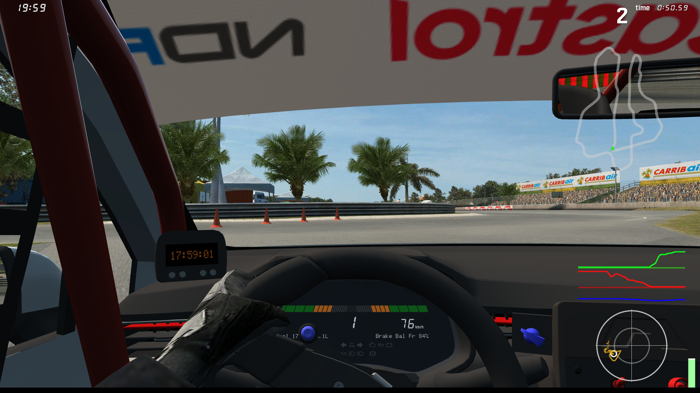

# Live Telemetry

This demo showcases `OutSim` and `OutGauge` to retrieve live data about the car. `InSim` itself
is not used here.

## Prerequisites

You need to set up `OutSim` and `OutGauge`, refer to the corresponding sections at the end of
`docs/InSim.txt`. `OutGauge` receives packets on port `29998` and `OutSim` on port `29997`, with
options set to `1ff`. Note that `OutSim` in particular only works on cockpit view and custom view.

## How To

Launch the demo scene, after setting up `OutSim` and `OutGauge`.

The demo app will display your throttle, brake and steering inputs over the last 5 seconds,
as well as the current g-forces experienced in the last 2 seconds. The radar shows accelerations
up to 2g, with the inner circle at 1g.

Throttle and brake charts also display the use of TC and ABS by filling the chart vertically.

Note: In order to overlay the telemetry widget on top of LFS, you need to enable per-pixel
transparency and transparent viewport background in the project settings. You should also make
the window borderless, and preferably always on top.

