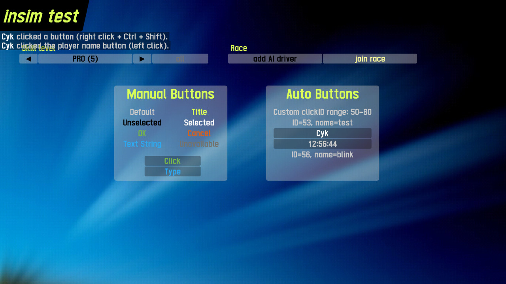
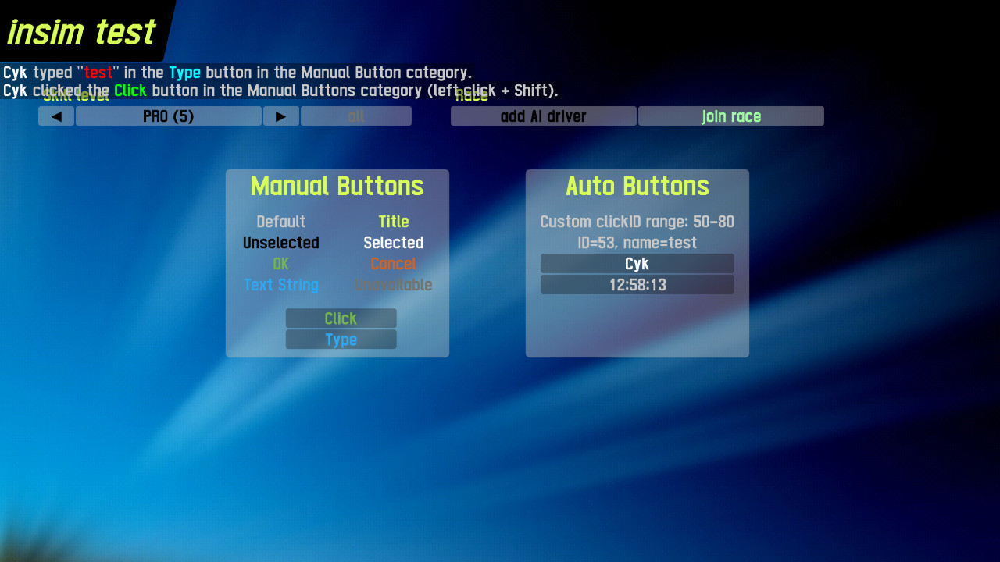

# InSim Buttons

This demo showcases using `InSim`'s utility functions to create, retrieve and delete buttons.

## Prerequisites

This demo does not need anything in particular, other than LFS listening for InSim connections.

## How To

Launch the demo scene, InSim will connect automatically (LFS should already be running
and listening to InSim connections on port 29999, type `/insim 29999` if necessary).

This demo is a host InSim program, it works in multiplayer too. Two panels containg various buttons
appear: the "Manual Buttons" panel contains buttons created manually by sending the corresponding
`IS_BTN` packets; the "Auto Buttons" panel contains buttons created using `InSim.add_button()`,
allowing for more concise declaration, button naming for later identification, as well as mapping
a button's text to each connection, e.g. to display the player's name for each player through
a single button definition.

Handling of `IS_BFN`, `IS_BTC` and `IS_BTT` packets is also demonstrated.

