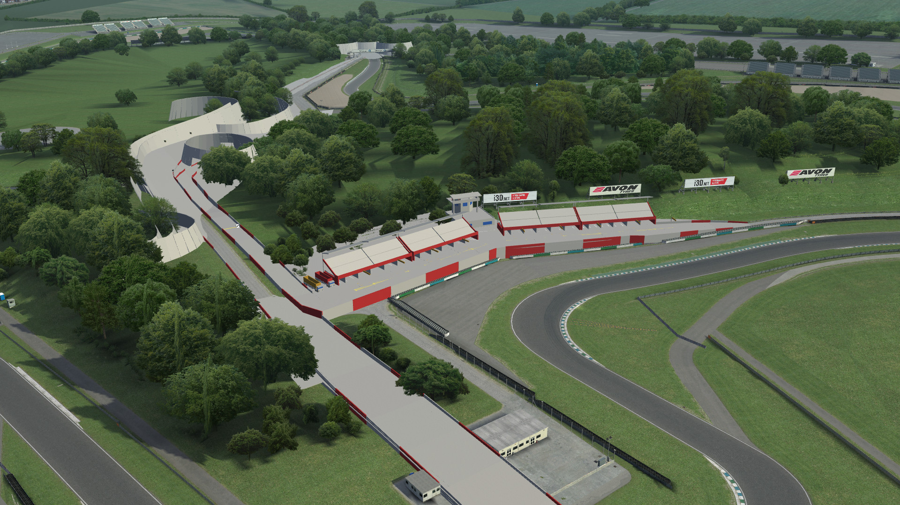

# Layout Viewer

This demo showcases SMX parsing and 3D mesh generation, as well as loading and displaying
layouts and keeping them synchronized with any changes made in LFS.

## Prerequisites

This demo requires SMX files to work, you can download those
[from the LFS website](https://www.lfs.net/programmer). You should update the paths
in the root node's inspector to ensure both SMX and layout files can be loaded.

## How To

Launch the demo scene, InSim will connect automatically (LFS should already be running
and listening to InSim connections on port 29999, type `/insim 29999` if necessary).

As soon as you load a track, GodotInSim will load the corresponding SMX file and display its mesh.
The camera will replicate the LFS camera. When you load a layout, its objects will display on top
of the SMX mesh. Any modification to the layout in LFS (loading or clearing the layout, adding,
removing or modifying objects) will also be replicated.

Note: Unsaved changes to the layout in LFS are not replicated when launching this demo; this can
however be achieved by requesting AXM packets on startup instead of loading the layout.

There may be a few discrepancies for objects that are placed "on ground", as the layout only
provides approximate altitude information, and the raycast to place it more accurately may give
different results between GodotInSim (raycasting to the SMX mesh) and LFS. GodotInSim first tries
to cast the object down, and if it fails to do so, it will instead try to cast up.

