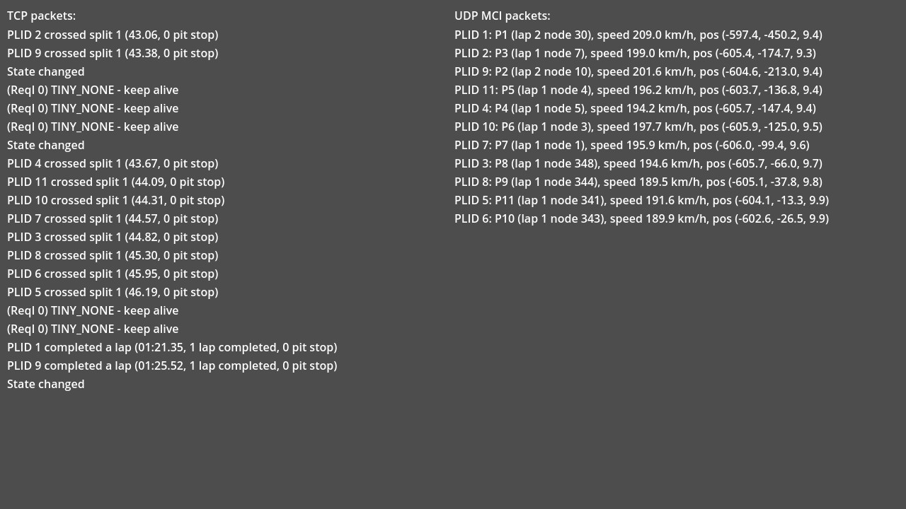

# Mixed TCP/UDP connection

This demo showcases using an `InSim` connection with both TCP and UDP. The connection uses TCP
for all packets except `IS_MCI`, which are sent via UDP.

## Prerequisites

LFS should be open and listening on port `29999`. `IS_MCI` packets will be sent via UDP on
port `30000`.

## How To

Launch the demo scene, all packets received in the game appear in the left **TCP packets** column,
except `IS_MCI` packets, which have their data displayed in the **UDP MCI packets** column.

