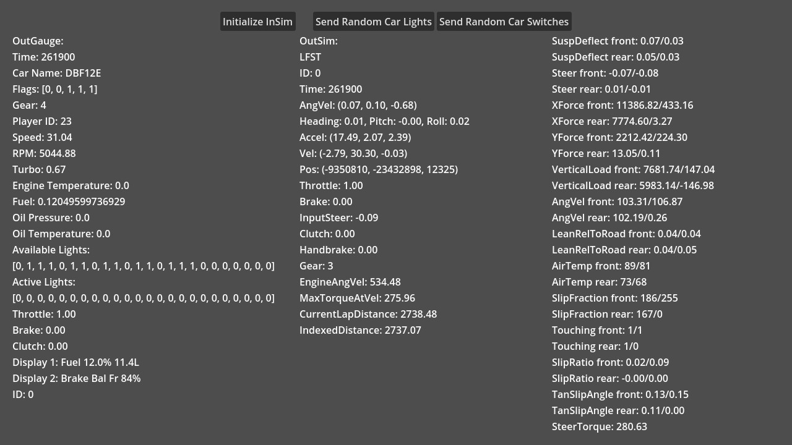

# Multiple protocols

This demo showcases using `InSim`, `OutGauge`, and `OutSim` at the same time.

## Prerequisites

LFS should be open and listening on port `29999`. For OutGauge and OutSim to work,
you need to edit the `cfg.txt` file:

* `OutSim Mode` and `OutGauge Mode` should be set to `1` or `2`.
* `OutGauge Port` should be set to `29998`.
* `OutSim Port` should be set to `29997`.
* `OutSim Opts` should be set to `1ff` (other values can also work, see `OutSim` documentation).

## How To

Launch the demo scene, you can start and close the InSim connection with the first button (LFS
should already be running and listening to InSim connections on port 29999, type `/insim 29999`
if necessary).

You can toggle random lights and switches by clicking the corresponding buttons, as demonstrated
in the video below (note that there is sound in the video, as both horn and siren sound
randomly as well).

Additionally, all available `OutGauge` and `OutSim` data is displayed in real time as text values.

