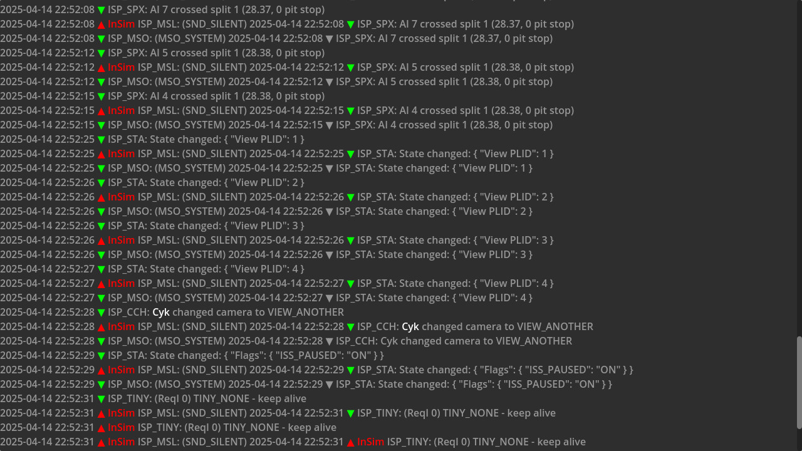
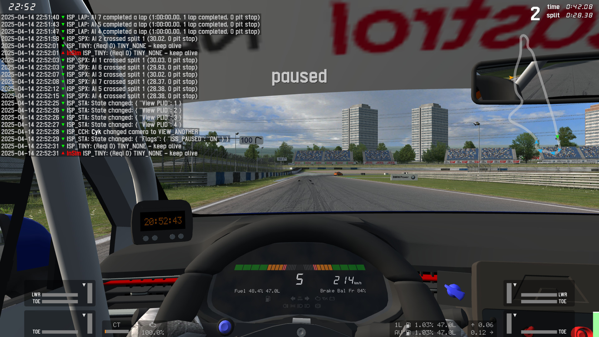

# Packet logger

This demo showcases packet handling and sending messages.

## Prerequisites

This demo does not need anything in particular, other than LFS listening for InSim connections.

## How To

Launch the demo scene, InSim will connect automatically (LFS should already be running
and listening to InSim connections on port 29999, type `/insim 29999` if necessary).

Every time a packet is sent or received, GodotInSim will send a local message to display
the packet's contents on screen, and will also display it in its own window. Text message packets
are ignored in order to prevent infinite loops.

