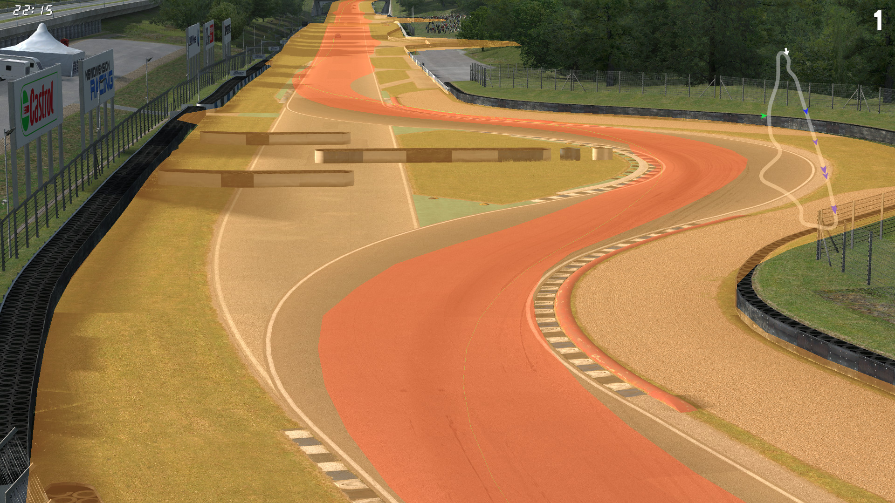

# PTH Viewer

This demo showcases PTH parsing and 3D mesh generation.

## Prerequisites

You should update the paths in the root node's inspector to ensure PTH files can be loaded.

## How To

Launch the demo scene, InSim will connect automatically (LFS should already be running
and listening to InSim connections on port 29999, type `/insim 29999` if necessary).

As soon as you load a track, GodotInSim will load the corresponding PTH file and display its mesh.
The camera will replicate the LFS camera. You can move this demo's window on top of LFS to see
the PTH mesh overlaid on top of LFS (for this to work, you need to make the viewport background
transparent, as well as allow per-pixel transparency for the window, in the project settings).

