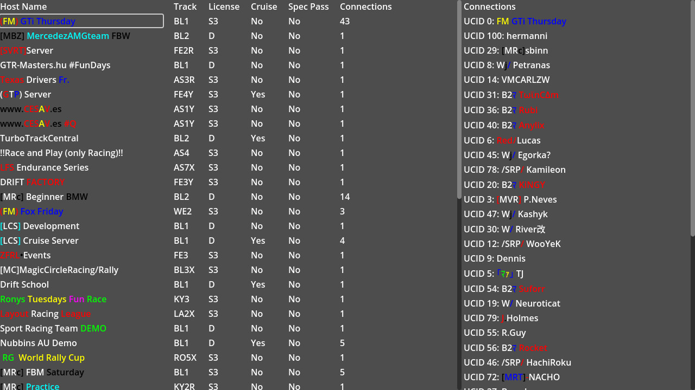

# InSim Relay

This demo showcases using the `InSim Relay` to show a list of hosts and connect to one.

## Prerequisites

This demo does not need anything in particular.

## How To

Launch the demo scene, InSimRelay will connect automatically and request hosts with `IRP_HLR`.

The list of LFS hosts will be displayed with all available information. When you click a host,
an `IRP_SEL` packet is sent to request connection, then a `TINY_NCN` will request the list of
connected players, which will be displayed on the right part of the window.

