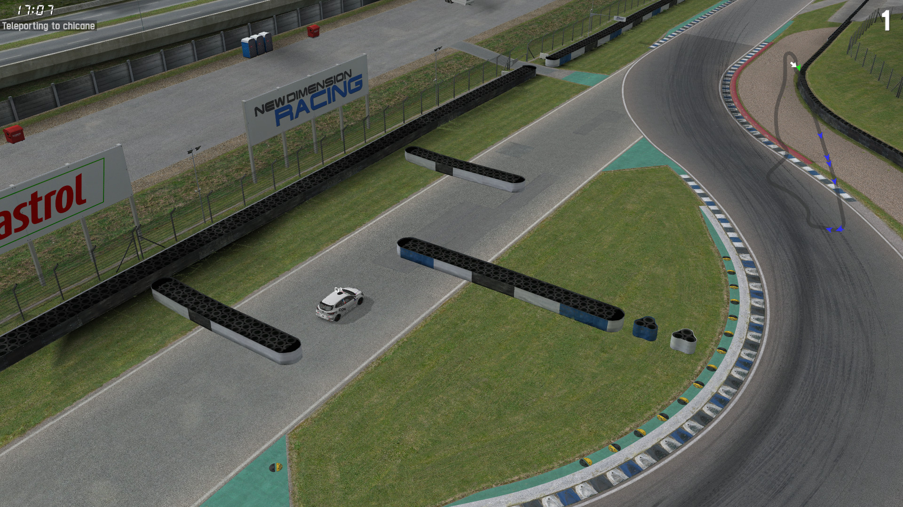

# Teleporter

This demo showcases using `IS_JRR` packets for teleporting, as well as InSim message handling
by parsing commands received via `IS_MSO` and `IS_III`.

## Prerequisites

This demo does not need anything in particular, other than LFS listening for InSim connections.

## How To

Launch the demo scene, InSim will connect automatically (LFS should already be running
and listening to InSim connections on port 29999, type `/insim 29999` if necessary).

This demo is a host InSim program, it works in multiplayer too. Players can send a teleport command
by typing either `!teleport <arg>` or `/i teleport <arg>`, which will be received by InSim as
an `IS_MSO` packet or an `IS_III` packet respectively. `!` is set as the demo's InSim prefix, so
the `IS_MSO` packet is seen as a prefix message and not displayed to other players.

The teleport command can take the following arguments:
* Named locations: `service`, `chicane` or `ambulance` (those are preset locations at Blackwood);
* Coordinates: `teleport (x, y, z)` where `x`, `y` and `z` are in meters, and `z` is optional;
* Nothing: `teleport` alone will teleport the player to a random location (often out of bounds).

Upon teleport, a message is sent to the player with the destination coordinates (`IS_MSL` in
single player, `IS_MTC` in multiplayer).

