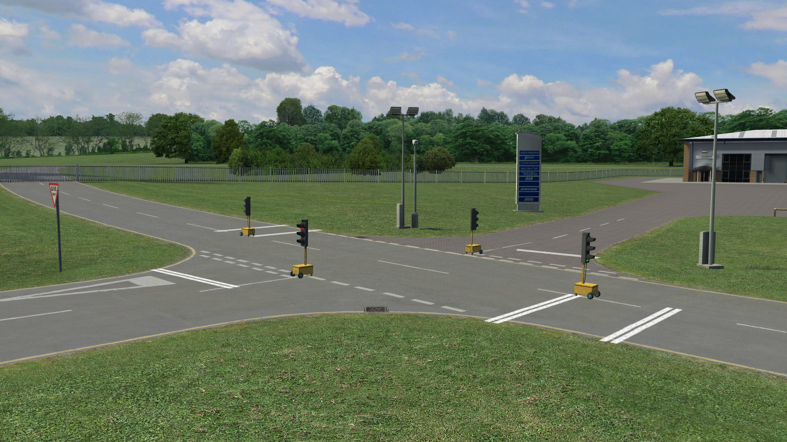
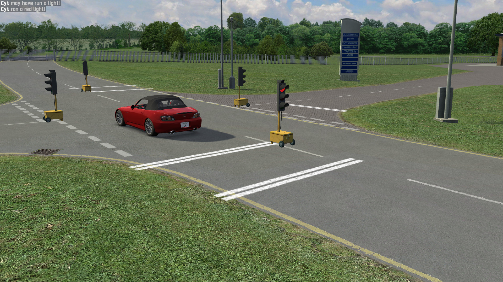

# Traffic Lights

This demo showcases the use of `IS_OCO` and `IS_UCO` packets for light control and car detection,
as well as adding layout objects via `IS_AXM` packets.

## Prerequisites

This demo is intended to run on a Westhill open configuration (WE1X, WE2Y, etc.). If another
environment is loaded, you will be prompted to load Westhill and the demo will end immediately.
Note that the demo can be launched while in the race setup screen, as long as Westhill is loaded.

## How To

Launch the demo scene, InSim will connect automatically (LFS should already be running
and listening to InSim connections on port 29999, type `/insim 29999` if necessary).

This demo is a host InSim program, it works in multiplayer too. The intersection near the workshops
(North West, coordinates X-530 Y780) is equipped with traffic lights working in opposite pairs.
Each light features 2 detection lines and an approach detection zone located 15 meters before
the first line.

Crossing a detection line while the light is red will send a message, and entering the detection
zone will increase the green light duration by 5 seconds, or decrease the red light duration.

The light sequence is 15-second green, 4-second amber, 2-second red before the next green.

