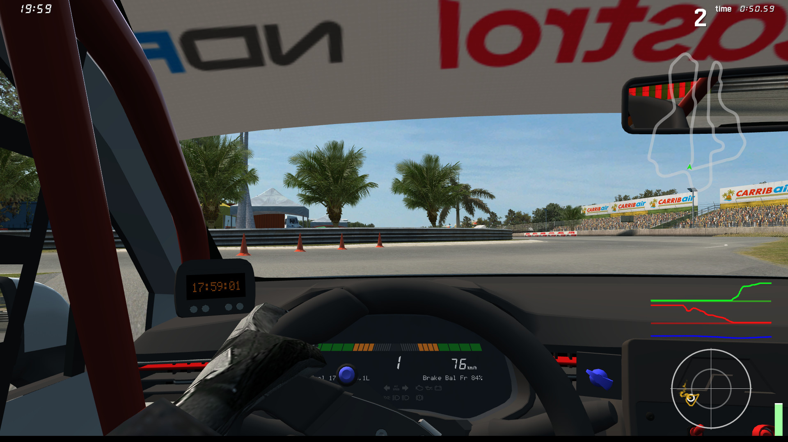

# Basic Telemetry

This demo showcases the use of [OutSim](../../../class_ref/OutSim.mdx) and
[OutGauge](../../../class_ref/OutGauge.mdx) to retrieve live data about your car.
[InSim](../../../class_ref/InSim.mdx) is not used at all here.

## Prerequisites

This demo requires [setting up OutSim](../../getting_started/outsim.md)
and [OutGauge](../../getting_started/outgauge.md) to properly receive the corresponding packets.

## The demo

The demo itself is a small window displaying inputs charts for throttle, brake and steering,
as well as a G-meter showing longitudinal and lateral acceleration. Throttle and brake come from
OutGauge data, while steering and G-forces come from OutGauge; OutGauge inputs are chosen for
their better reliability, in that OutSim only outputs data from the driver and custom views,
while OutGauge works with all views. OutGauge also provides the state of various dash lights,
which are used to retrieve ABS and TC data, and show those on the charts.

If you launch the demo from the editor, chances are the window will have a solid background,
and you will need to go to **Project Settings** and enable the following settings:

* Display > Window > Per Pixel Transparency > Allowed
* Rendering > Viewport > Transparent Viewport

If you launch the standalone executable for the demo, those settings are already enabled.

:::note

The window is borderless and always on top, you should be able to move it by bringing up the
<kbd>Alt + Space</kbd> menu on Windows, or simply <kbd>Alt + LMB</kbd> on Linux (or the
shortcut you set for moving windows).

:::
