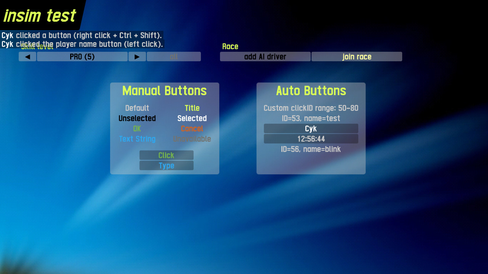

# InSim Buttons

This demo showcases InSim buttons.

## Prerequisites

This demo only requires [InSim](/guides/getting_started/insim.md) to be listening on port `29999`,
which you can do by typing `/insim 29999` in LFS.

## The demo

The demo is a host InSim program, so it works in multiplayer too. Two panel containing various
buttons are displayed: the **Manual Buttons** panel contains buttons created by sending the
corresponding [InSimBTNPackets](/class_ref/InSimBTNPacket.mdx); the **Auto Buttons** panel
contains buttons created using InSim's
[add_button()](/class_ref/InSim.mdx#class_InSim_method_add_button), allowing for more concise
declaration, button naming for later identification, as well as mapping a button's text to each
connection, e.g. to display each player's name through a single button definition.

Handling of [InSimBFNPacket](/class_ref/InSimBFNPacket.mdx),
[InSimBTCPacket](/class_ref/InSimBFNPacket.mdx),
and [InSimBTTPacket](/class_ref/InSimBFNPacket.mdx) is also demonstrated in this demo.

Clicking any button will show what mouse button was used, and whether <kbd>Shift</kbd> or
<kbd>Ctrl</kbd> modifier keys were pressed, and the button displaying your name will also
toggle its button name and ID.
