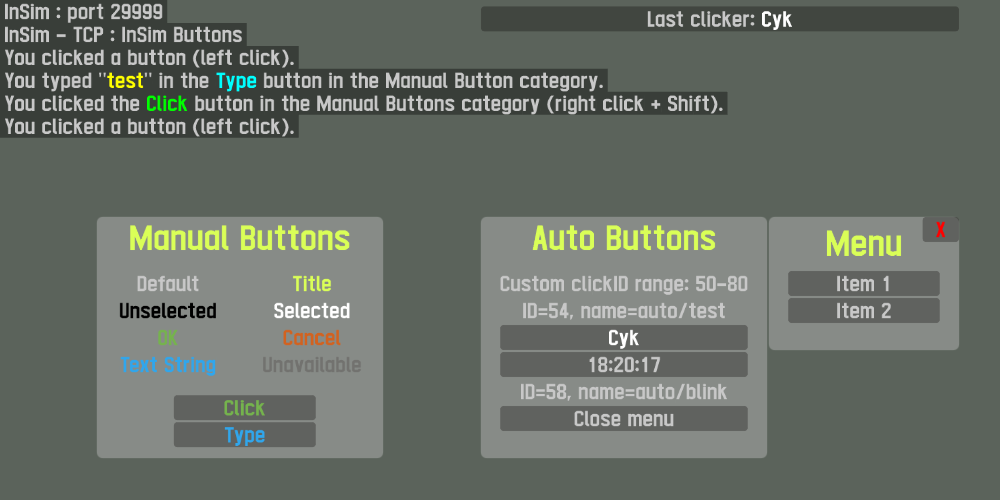

# InSim Buttons

This demo showcases InSim buttons. You can find the code
[here](https://gitlab.com/godot-insim/godot_insim/-/blob/main/addons/godot_insim/demo/buttons/demo_buttons.gd).

## Prerequisites

This demo only requires [InSim](/guides/getting_started/insim.md) to be listening on port `29999`,
which you can do by typing `/insim 29999` in LFS.

## The demo

The demo is a host InSim program, so it works in multiplayer too. Two panel containing various
buttons are displayed: the **Manual Buttons** panel contains buttons created by sending the
corresponding :class_ref[InSimBTNPacket]s; the **Auto Buttons** panel
contains buttons created using InSim's :class_ref[add_multi_button()]{target="InSim#method_add_multi_button"}
and :class_ref[add_multi_button()]{target="InSim#method_add_multi_button"}, allowing for more concise
declaration, button naming for later identification, as well as mapping a button's text to each connection,
e.g. to display each player's name through a single button definition.

Handling of :class_ref[InSimBFNPacket], :class_ref[InSimBTCPacket], and :class_ref[InSimBTTPacket]
is also demonstrated in this demo.

Clicking any button will show what mouse button was used, and whether <kbd>Shift</kbd> or
<kbd>Ctrl</kbd> modifier keys were pressed, and the button displaying your name will also
toggle its button name and ID.
