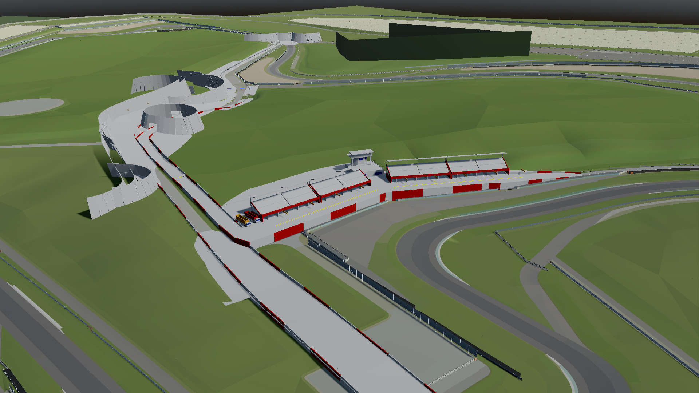

# Layout Viewer

This demo showcases [SMX](../../../class_ref/SMXFile) parsing and 3D mesh generation, as well as
loading and displaying [layouts](../../../class_ref/LYTFile) and keeping them synchronized with
any changes made in LFS.

## Prerequisites

This demo requires SMX files to work, you can download those
[from the LFS website](https://www.lfs.net/programmer). You should update the paths
in the root node's inspector to ensure both SMX and layout files can be loaded.
GodotInSim also a custom SMX file for the Layout Square environment.

:::warning

SMX files are by nature simplified models of LFS tracks, but some of them are either outdated
(Blackwood) or missing entirely (Rockingham); the upcoming update for LFS, which should include
updated South City, Kyoto, and Aston environments, will likely make matters worse for SMX.

:::

## The demo

In LFS, loading any environment will cause the corresponding SMX file to be loaded in GodotInSim;
the camera will also synchronize with LFS, and loading a layout will display it on top of the SMX
model. Any modification to the layout in LFS will be replicated (if you start the demo with a
layout that has been modified but not saved, unsaved modifications will not be replicated properly;
this is only a limitation of the demo itself, you can properly update every object using
[InSimAXMPackets](../../../class_ref/InSimAXMPacket)).
