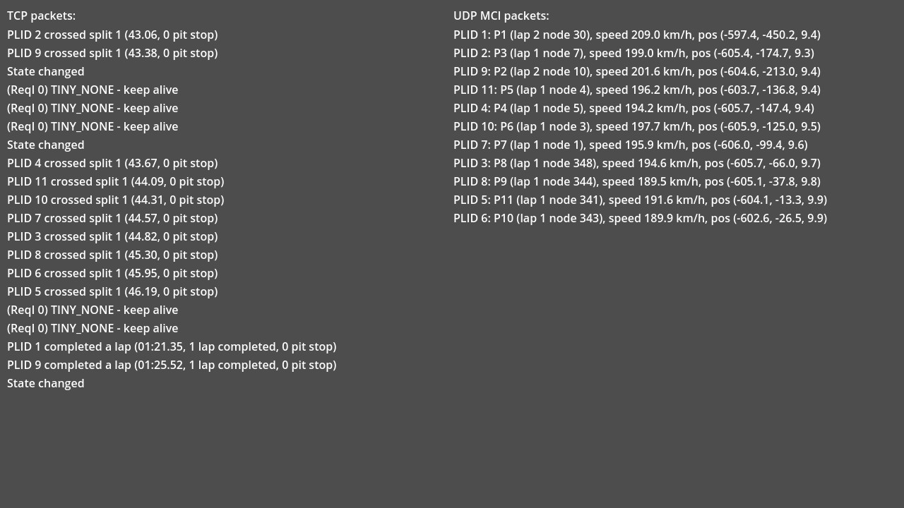

# Mixed TCP/UDP

This demo showcases using both TCP and UDP in a single InSim app.

## Prerequisites

This demo only requires [InSim](/guides/getting_started/insim.md) to be listening on port `29999`,
which you can do by typing `/insim 29999` in LFS. UDP packets will be sent on port `30000`.

## The demo

The demo's window is split in 2 columns: **TCP packets** on the left, and **UDP packets**
on the right. All received packets appear in the TCP column, as the main connection
is over TCP; [InSimMCIPackets](/class_ref/InSimMCIPacket.mdx), however, are received over
UDP, and their data is displayed in the UDP column. Doing so allows for frequent MCI updates
without polluting the TCP stream, and may decrease latency from those packets; on the other hand,
some MCI packets may drop or arrive out of order.

If you set the
[udp_port](/class_ref/InSimInitializationData.mdx#class_InSimInitializationData_property_udp_port)
to a non-zero value in a TCP connection, NLP/MCI packets received via UDP emit the
[udp_packet_received](/class_ref/InSim.mdx#class_InSim_signal_udp_packet_received) signal
instead of the usual [packet_received](/class_ref/InSim.mdx#class_InSim_signal_packet_received).
Note that only [NLP](/class_ref/InSimNLPPacket.mdx) and [MCI](/class_ref/InSimMCIPacket.mdx)
packets can be received over UDP this way; if you use a full UDP connection, all packets will emit
the [packet_received](/class_ref/InSim.mdx#class_InSim_signal_packet_received) signal.
