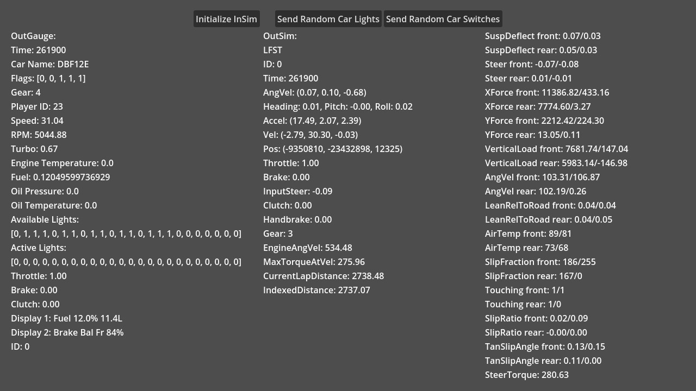

# Multiple Protocols

This demo showcases using InSim, OutSim, and OutGauge in a single InSim app.

:::tip

You can also use multiple InSim instances from a single app.

:::

## Prerequisites

This demo needs [InSim](../../getting_started/insim.md) to be listening on port `29999`,
which you can do by typing `/insim 29999` in LFS. It also requires
[OutSim](../../getting_started/outsim.md) and [OutGauge](../../getting_started/outgauge.md) to be
set up on ports `29997` and `29998`.

## The demo

The demo's window contains buttons that allow you to control InSim functions, and below those
buttons are raw OutGauge and OutSim output data. You can notice that OutGauge and OutSim update
independently of InSim running.
