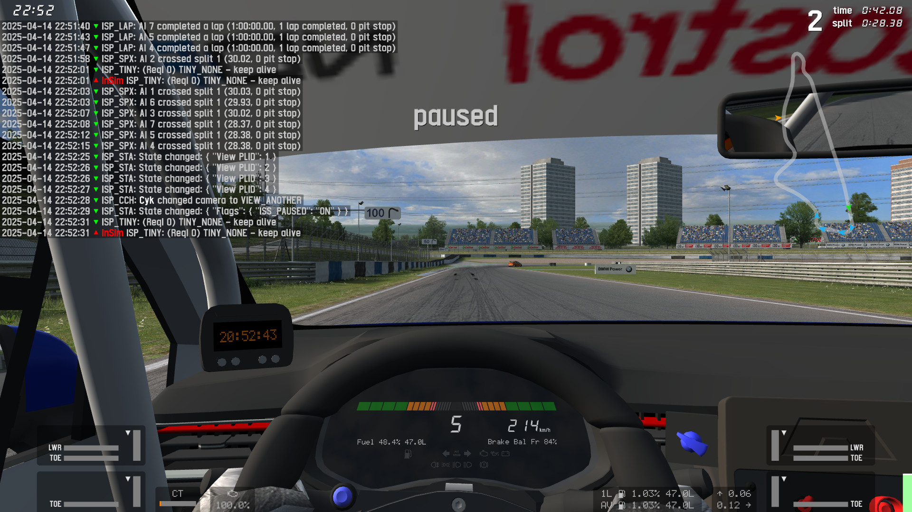

# Packet Logger

This demo showcases InSim packet handling and sending messages.

## Prerequisites

This demo only needs [InSim](/guides/getting_started/insim.md) to be listening on port `29999`,
which you can do by typing `/insim 29999` in LFS.

## The demo

Every time a packet is sent or received, GodotInSim will send a local message to display
the packet's contents on screen, and will also display it in its own window. Text message
packets are ignored in order to prevent infinite loops.
