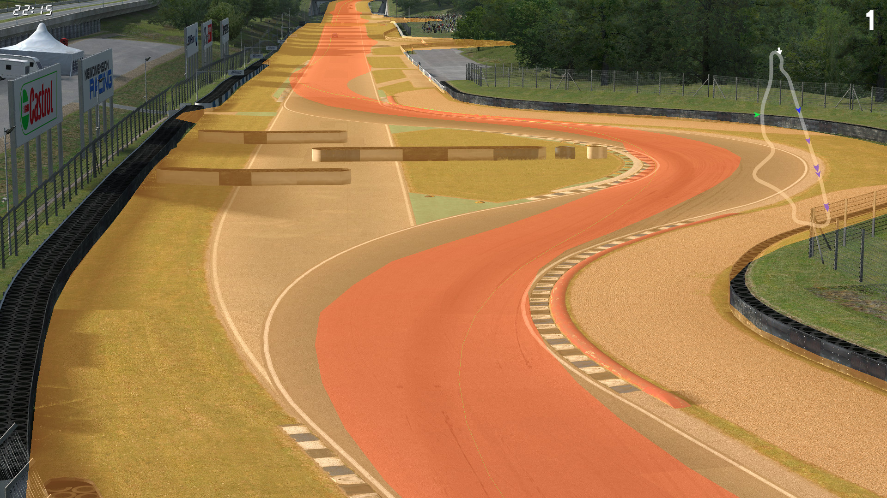

# PTH Viewer

This demo showcases PTH parsing and 3D mesh generation.

## Prerequisites

This demo requires setting the path to the `data/smx` folder of your LFS install, in the
scene's root node inspector.

It also needs [InSim](/guides/getting_started/insim/intro.md) to be listening on port `29999`,
which you can do by typing `/insim 29999` in LFS.

## The demo

When you start the demo or any time you load a new track, GodotInSim will load the corresponding PTH
file and display its mesh. The camera will also replicate the LFS camera at all times. You can move
this demo's window on top of LFS to see the PTH mesh as an overlay (for this to work, you need to
make the viewport background transparent and enable per-pixel transparency for the window in the
project settings).

The green line connects all the [PTHNodes](/class_ref/PTHNode.mdx) together, the red area
corresponds to the "track limits" (you will notice that some areas do not use the entire track
width, while other areas go beyond the white lines), and the yellow area corresponds to the absolute
limits of the track (including grass and gravel, as well as the pitlane and anything beyond track
limits).
