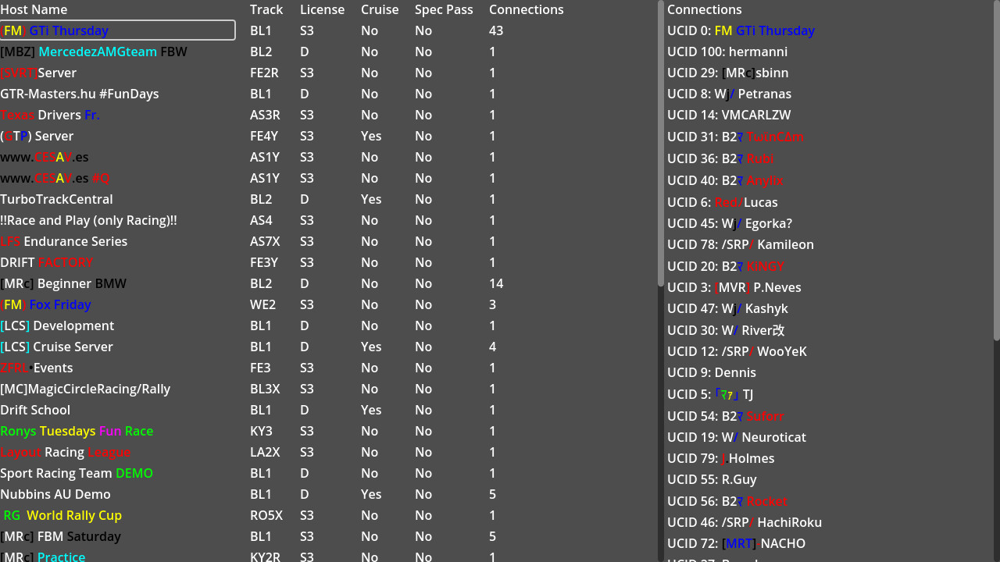

# InSim Relay

This demo showcases using the `InSim Relay` to show a list of hosts and connect to one.

## Prerequisites

This demo does not need LFS to be running.

## The demo

Upon start, the relay will connect automatically and display a list of available hosts. Note that
the relay is opt-in for hosts, so there will likely be less hosts than the in-game list.

When you click a host, the list of connected players will be displayed on the right.

:::tip

For more info about the Relay and what packets you can send to it, see
[this thead](https://www.lfs.net/forum/thread/30740).

:::
