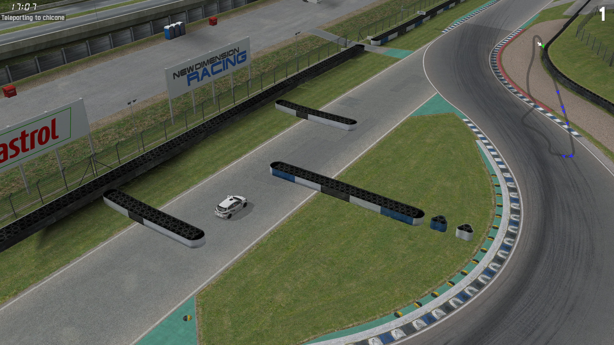

# Teleporter

This demo showcases using [InSimJRRPacket](/class_ref/InSimJRRPacket.mdx) for teleporting,
as well as InSim message handling by parsing commands received via
[MSO](/class_ref/InSimMSOPacket.mdx) and [III](/class_ref/InSimIIIPacket.mdx) packets.

## Prerequisites

This demo only needs [InSim](/guides/getting_started/insim.md) to be listening on port `29999`,
which you can do by typing `/insim 29999` in LFS.

## The demo

This demo is a host InSim program, it works in multiplayer too. Players can send a teleport command
by typing either `!teleport <arg>` or `/i teleport <arg>`, which will be received by InSim as an
[InSimMSOPacket](/class_ref/InSimMSOPacket.mdx) or an
[InSimIIIPacket](/class_ref/InSimIIIPacket.mdx) respectively. `!` is set as the demo's InSim
prefix, so messages starting with this character will not be displayed to other players.

The teleport command can take the following arguments:

* Named locations: refer to the corresponding file in `spawn/track.txt` (all open configs read
spawn points from the same file, e.g. `WE.txt` for WE1X, WE1Y, WE2X, etc.);
* Coordinates: `teleport (x, y, z)` where `x`, `y` and `z` are in meters, and `z` is optional;
* Nothing: `teleport` alone will teleport the player to a random location (often out of bounds).

Upon teleport, a message is sent to the player with the destination coordinates, using an
[InSimMSLPacket](/class_ref/InSimMSLPacket.mdx) in single player, or an
[InSimMTCPacket](/class_ref/InSimIIIPacket.mdx) in multiplayer.

:::tip

For a better user experience, add [InSim buttons](../buttons/demo_buttons) to display the list
of available teleport points.

:::
