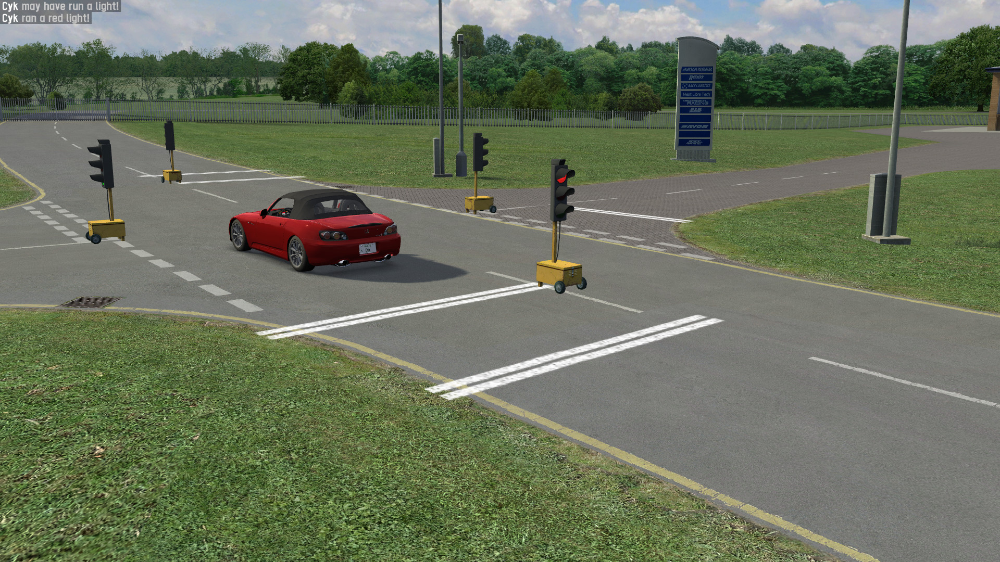

# Traffic Lights

This demo showcases using [InSimOCOPacket](../../../class_ref/InSimOCOPacket) for light control
and [InSimUCOPacket](../../../class_ref/InSimUCOPacket) for car detection, as well as adding
layout objects via [InSimAXMPackets](../../../class_ref/InSimAXMPacket).

## Prerequisites

This demo is intended to run on a Westhill open configuration (WE1X, WE2Y, etc.). If any other
environment is loaded, you will be prompted to load Westhill and the demo will close immediately.

This demo only needs [InSim](../../getting_started/insim.md) to be listening on port `29999`,
which you can do by typing `/insim 29999` in LFS.

## The demo

This demo is a host InSim program, it works in multiplayer too. The intersection near the workshops
(North West, coordinates X-530 Y780) is equipped with traffic lights working in opposite pairs.
Each light features 2 detection lights and an approach detection zone located 15 meters before
the first line.

Crossing a detection line while the light is red will send a message, and entering the detection
zone will increase the green light duration by 5 seconds, or decrease the red light duration.

The light sequence is 15-second green, 4-second amber, 2-second red before the next green.
