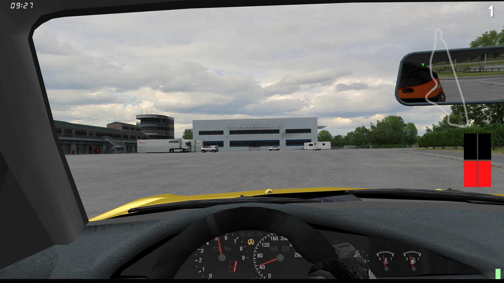

# OutSim

Using OutSim requires a bit more setup than InSim, similarly to [OutGauge](../outgauge.md).

## Enabling OutSim

You need to edit the `cfg.txt` file in the root folder of your LFS install.

:::warning

Make sure the game is *not* running while editing this file, otherwise your changes
may be overridden.

:::

At almost the end of the file, change the lines starting with `OutSim` to the following:

```text
OutSim Mode 2
OutSim Delay 1
OutSim IP 127.0.0.1
OutSim Port 29998
OutSim ID 0
OutSim Opts 1ff
```

* `Mode` controls where OutSim is active: disabled/while driving/while driving and during replays.
* `Delay` controls how often packets are sent, as hundredths of a second.
* `IP` and `Port` control where the packets are sent.
* `ID` can be set to identify this connection.
* `Opts` control what data will be sent by OutSim; the value is hexadecimal. `1ff` corresponds to
   all possible data being included.

## Receiving packets

Now that OutSim is enabled, let's make a new scene based on :godot[Node] and attach a new script.

```gdscript
extends Node

var outsim: OutSim = null

func _ready() -> void:
	outsim = OutSim.new()
	add_child(outsim)
	
	var _connect := outsim.packet_received.connect(_on_packet_received)
	
	outsim.initialize(0x1ff)  # The options should match those in cfg.txt
	# Like OutGauge, we can skip the address and port if they are equal to the default values.

func _on_packet_received(packet: OutSimPacket) -> void:
	print("OutSim packet received!")
```

Just like [OutGauge](../outgauge.md), you can create an OutSim instance entirely from code, or add it
as a node in your scene and use `@onready`.

Initialization is almost the same as OutGauge, with one additional parameter: you have to specify
the InSim options, which should match the `Opts` value in `cfg.txt`.

We also add a callback function to print a message when packets are received.

Now launch the scene, launch the game if it's not already running, and start driving: you will see
packets coming in at a really fast pace. You can stop the test scene after a few seconds.

## OutSim Packets

LFS sends data based on the `Opts` you set in `cfg.txt`. To make things easier to use, GodotInSim
includes all data in the [OutSimPacket](/class_ref/OutSimPacket.mdx). Missing data will therefore
be at their default values; if you need to check which data is valid, the options value is included
in the [OutSimPacket](/class_ref/OutSimPacket.mdx).

## What can we do with this?

OutSim was initially intended to be used for motion rigs, but it can also be used for telemetry, as
an additional source of data for custom dashes, as a global sensor for AI driving, etc.

:::note

The game only sends OutSim data in driver view and custom view; any other view will disable all
data updates.

:::

## A practical example: wheel speed

### Introduction

In this section, we will create a simple traction loss detector: we will check the speed of
the driven wheels, and if any wheel spins faster than the current speed of the car, we will
flash a light.

We are going to use the [CarInfo](/class_ref/CarInfo.mdx) class to load a `CAR_info.bin` file
generated by pressing <kbd>O</kbd> in the garage view, to retrieve the drive type. We will then
use that to check only the driven wheels in the [OutSimPacket](/class_ref/OutSimPacket.mdx).

### Getting the data

We can easily parse the car info file and retrieve the drive type:

```gdscript
# You can use OutGauge or any InSim packet that gives you the vehicle ID,
# but we will only use the FZ5 for this example.
var vehicle_id := "FZ5"
# Load the car info file, assuming a default Windows LFS install.
var car_info := CarInfo.load_car_info("C:/LFS/data/raf/%s_info.bin" % vehicle_id)
var drive := car_info.drive
```

And we can use that to fill an array of driven wheels, with the following function:

```gdscript
func get_driven_wheels(drive: CarInfo.Drive) -> Array[OutSimPacket.WheelIndex]:
	var wheels: Array[OutSimPacket.WheelIndex] = []
	if drive in [CarInfo.Drive.RWD, CarInfo.Drive.AWD]:
		wheels.append_array([
			OutSimPacket.WheelIndex.REAR_LEFT,
			OutSimPacket.WheelIndex.REAR_RIGHT,
		])
	if drive in [CarInfo.Drive.FWD, CarInfo.Drive.AWD]:
		wheels.append_array([
			OutSimPacket.WheelIndex.FRONT_LEFT,
			OutSimPacket.WheelIndex.FRONT_RIGHT,
		])
	return wheels
```

:::note

OutSim packets always include 4 [OutSimWheel](/class_ref/OutSimWheel.mdx) objects, the order is
given in the [OutSimPacket.WheelIndex](/class_ref/OutSimPacket.mdx#enum_WheelIndex)
enum: rear left, rear right, front left, front right.

:::

Now we want to check the speed of the driven wheels; when we receive an OutSim packet, we first
add each wheel's angular velocity to an array:

```gdscript
func _on_packet_received(packet: OutSimPacket) -> void:
	var wheel_data := packet.outsim_pack.os_wheels
	var wheel_speeds: Array[float] = []
	for w in wheel_data.size():
		wheel_speeds.append(wheel_data[w].ang_vel)
```

Then we need to convert that angular velocity into linear velocity.
[OutSimWheel.ang_vel](/class_ref/OutSimWheel.mdx#property_ang_vel) is given in
rad/s, which is exactly what we need here; if the value is positive, the wheel is "going forward".
We now need the radius of the wheel, and we will ignore possible variations due to tyre pressure.
This is also data we can get from the CAR_info file:

```gdscript
var wheel_radii: Array[float] = []
for w in car_info.wheels.size():
	wheel_radii.append(car_info.wheels[w].get_wheel_radius())
```

Next, the conversion itself: Velocity at the contact patch (again, considering the theoretical
wheel radius) if simply the product of the angular velocity and radius. We can now compare the
wheel's speed to the car speed, which is part of the [OutSimMain](/class_ref/OutSimMain.mdx)
data of the OutSim packet:

```gdscript
	var car_speed := packet.outsim_pack.os_main.vel
	for w in wheel_speeds.size():
		if w not in driven_wheels or absf(wheel_speeds[w]) < 1.0:
			# We ignore non-driven wheels and negative speeds.
			continue
		wheel_speeds[w] = wheel_speeds[w] * wheel_radii[w]
		if wheel_speeds[w] > car_speed:
			print("Spinning!")
```

### Better visuals

We now have almost everything we need, so let's make a visual indicator instead of printing text.

Create a new scene based on a :godot[GridContainer] and set it to have 2 columns. Add a
:godot[ColorRect] as a child, give that color rect a black color and some dimensions, for instance
50x100. Now duplicate this rectangle to get 4 of them, and rename them to FrontLeft, FrontRight,
RearLeft, and RearRight. Make all 4 of them unique and add `@onready` variables for them.

:::tip

You can drag and drop the nodes into the code editor while holding <kbd>Ctrl</kbd> to automatically
add those lines:

```gdscript
@onready var front_left: ColorRect = %FrontLeft
@onready var front_right: ColorRect = %FrontRight
@onready var rear_left: ColorRect = %RearLeft
@onready var rear_right: ColorRect = %RearRight
```

:::

We know we will be coloring all rectangles every time a packet is received, so let's make a function
for this purpose:

```gdscript
func set_rect_color(rect: ColorRect, speeding: bool) -> void:
	rect.color = Color.RED if speeding else Color.BLACK
```

Now we just need to call this function instead of our earlier `print("Spinning!")`.

### Putting it all together

Adding everything we discussed so far, and after reorganizing the code a bit, we end up with the
following script (have a look at the comments for things that were not mentioned along the way):

```gdscript
extends Node

var outsim: OutSim = null

# highlight-start
# We declare some global variables here, instead of inside the functions.
var vehicle_id := "FZ5"
var driven_wheels: Array[OutSimPacket.WheelIndex] = []
var wheel_radii: Array[float] = []
# This is the list of color rects we added to the scene, indexed by their WheelIndex.
var indicators: Dictionary[OutSimPacket.WheelIndex, ColorRect] = {}

# We add a threshold to the spin detection, otherwise every time you apply throttle,
# the indicators light up. This is an arbitrary 10% threshold.
var threshold := 1.1
# highlight-end

@onready var front_left: ColorRect = %FrontLeft
@onready var front_right: ColorRect = %FrontRight
@onready var rear_left: ColorRect = %RearLeft
@onready var rear_right: ColorRect = %RearRight


func _ready() -> void:
	outsim = OutSim.new()
	add_child(outsim)

	var _connect := outsim.packet_received.connect(_on_packet_received)

	outsim.initialize(0x1ff)

	var car_info := CarInfo.load_car_info("C:/LFS/data/raf/%s_info.bin" % vehicle_id)
	var drive := car_info.drive
	driven_wheels = get_driven_wheels(drive)
	for w in car_info.wheels.size():
		wheel_radii.append(car_info.wheels[w].get_wheel_radius())
		# highlight-start
		# We fill the indicators dictionary with our ColorRects
		indicators[w] = (
			rear_left if w == OutSimPacket.WheelIndex.REAR_LEFT
			else rear_right if w == OutSimPacket.WheelIndex.REAR_RIGHT
			else front_left if w == OutSimPacket.WheelIndex.FRONT_LEFT
			else front_right
		)
		# highlight-end


func get_driven_wheels(drive: CarInfo.Drive) -> Array[OutSimPacket.WheelIndex]:
	var wheels: Array[OutSimPacket.WheelIndex] = []
	if drive in [CarInfo.Drive.RWD, CarInfo.Drive.AWD]:
		wheels.append_array([
			OutSimPacket.WheelIndex.REAR_LEFT,
			OutSimPacket.WheelIndex.REAR_RIGHT,
		])
	if drive in [CarInfo.Drive.FWD, CarInfo.Drive.AWD]:
		wheels.append_array([
			OutSimPacket.WheelIndex.FRONT_LEFT,
			OutSimPacket.WheelIndex.FRONT_RIGHT,
		])
	return wheels


func set_rect_color(rect: ColorRect, speeding: bool) -> void:
	rect.color = Color.RED if speeding else Color.BLACK


func _on_packet_received(packet: OutSimPacket) -> void:
	var wheel_data := packet.outsim_pack.os_wheels
	var wheel_speeds: Array[float] = []
	for w in wheel_data.size():
		wheel_speeds.append(wheel_data[w].ang_vel)

	var car_speed := packet.outsim_pack.os_main.vel
	# highlight-start
	# Here we include the car's heading, so the velocity is compared to the forward direction
	# of the car; otherwise we would miss some tyre spinning because of the lateral velocity.
	# We then use the dot product to update the speed we will compare to.
	# NOTE: This is an oversimplification, but it works well enough for this example.
	var car_heading := packet.outsim_pack.os_main.gis_angles.z
	car_speed *= car_speed.normalized().dot(Vector3(0, 1, 0).rotated(Vector3(0, 0, 1), car_heading))
	# highlight-end
	for w in wheel_speeds.size():
		if w not in driven_wheels or absf(wheel_speeds[w]) < 1.0:
			continue
		wheel_speeds[w] = wheel_speeds[w] * wheel_radii[w]
		# highlight-start
		# We now set the rectangles' colors based on the wheel and car speeds,
		# including our new threshold.
		var overspeed := true if wheel_speeds[w] > car_speed.length() * threshold else false
		set_rect_color(indicators[driven_wheels[w]], overspeed)
		# highlight-end
```

And this is the result when you go for a drift or spin the tyres when you start driving:



## More ideas

You can trigger all sorts of alerts from the state of the car: speed limits, wheel spin, wheels not
touching the ground, upside-down car from the pitch and/or roll angles, odometer, etc.

Some of the data available to OutSim is also available via
[InSimMCIPackets](/class_ref/InSimMCIPacket.mdx), albeit with less precision, but this allows
you to work around the limitations of OutSim.

:::warning

OutSim only works in the driver and custom views, and only for local cars. This means that in
multiplayer, you can only use OutSim for your own car, and an MPR replay will not output OutSim
data at all.

:::
